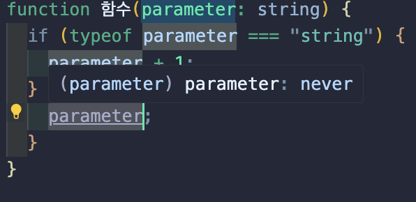

# 함수에 사용하는 never 타입

## Never type 이란?

- 절대 발생할 수 없는 타입을 나타낸다.

## 특징

- 함수 표현식이나 화살표 함수 표현식에서 항상 오류를 발생시키거나 절대 반환하지 않는 반환 타입으로 쓰인다.
- 모든 타입에 할당 가능한 하위 타입이다.
- 함수의 마지막에 도달할 수 없다.

## 함수에 사용하는 never 타입

- 함수가 절대 return 하지 않아야 한다.
- 함수 실행이 끝나지 않아야 한다.

- while 문법은 () 소괄호안의 조건식이 true 일 경우 계속 내부 코드를 실행시키라는 뜻이므로, 무한히 실행되기 떄문에, never 타입이 사용가능하다.

```
function 함수() :never{
  while ( true ) {
    console.log(123)
  }
}
```

- throw new Error() 문법은 강제로 에러를
  발생시키는 데, 에러가 나면 전체 코드실행이 중단되서,
  함수 실행이 끝나지 않게 된다.

```
function 함수() :never{
  throw new Error('에러메세지')
}
```

## 파라미터에서 사용하는 never 타입

잘못된 narrowing을 사용했을 경우, 파라미터의 타입이 never로
변한다. 이때, never 타입의 의미는 있어서는 안되는 일이
일어나고 있으니, 수정하라고 알려주는 느낌이다.

```
function 함수(parameter: string) {
  if ( typeof parameter === "string"){
    parameter + 1;
  } else {
    parameter;
  }
}
```



else 문이 말이 안되기 때문에, 파라미터가 never 타입으로 변한다.

## 자동으로 never 타입을 가지는 경우

자바스크립트는 함수를 만드는 2가지 방법이 있는데,

**함수 선언문**

```
function 함수(){

}
```

- 아무것도 return 하지 않고 끝나지도 않을 경우 void 타입 return 타입이 자동 할당

**함수 표현식**

```
let 함수2 = function (){

}
```

- 아무것도 return 하지 않고 끝나지도 않을 경우 never 타입이 자동 할당
